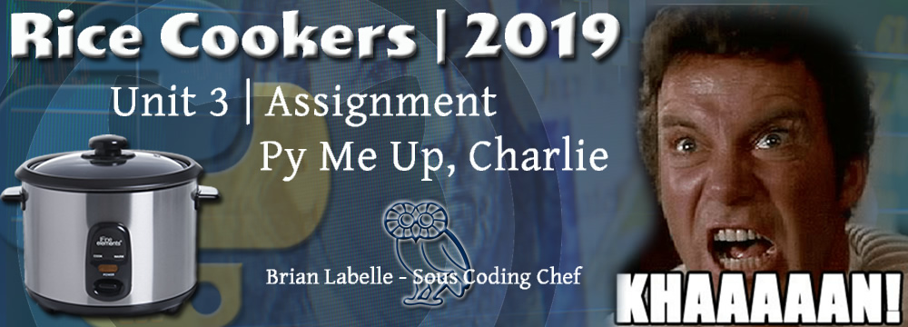

# Python Challenge
Rice University Data Analytics Bootcamp | Python Challenge | Brian Labelle

## Getting Started

- some stuff will go here...

### Prerequisites

- Python 3.7.3

## Deployment
0.1 Working on it.

## Built With

* [Blood, Sweat & Tears](http://www.pandora.com/) - Entertainment
* [Python](https://www.python.org/) - Codes Stuff
* [Github](https://github.com) - Holds Stuff
* [Visual Studio Code](https://code.visualstudio.com/) - Debugs Stuff
* [Coca-Cola](https://us.coca-cola.com/) - Fuels Stuff
* [Adobe Fireworks](https://www.adobe.com/products/fireworks.html) - Makes Pictures

 

## Authors

* **Brian Labelle** - [Rice Cooker - Sous Chef](https://github.com/BrianLabelle)

## License

This project is licensed under the $$$$ License

## Acknowledgments

* Hat tip to anyone whose code was used
* Inspiration
* etc
